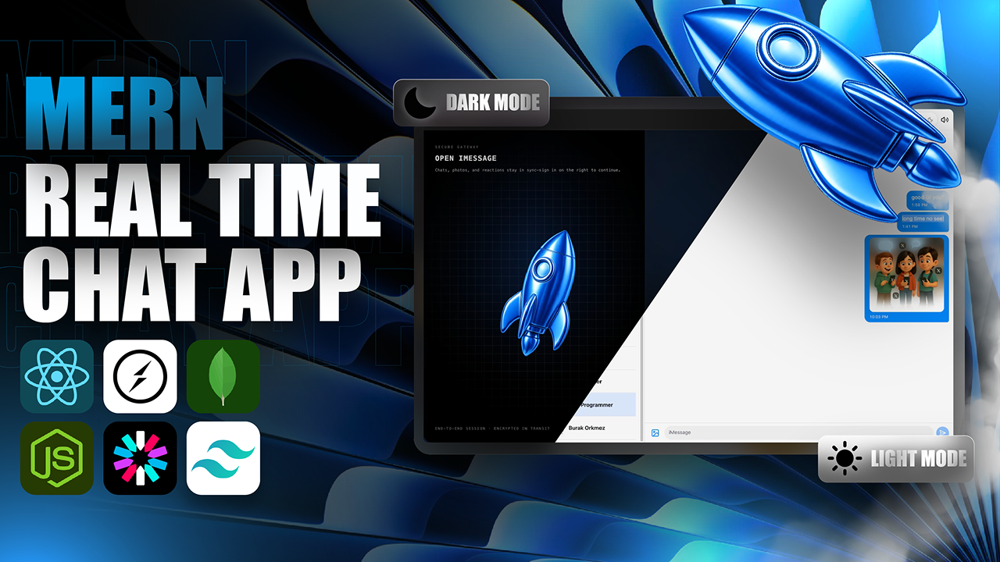
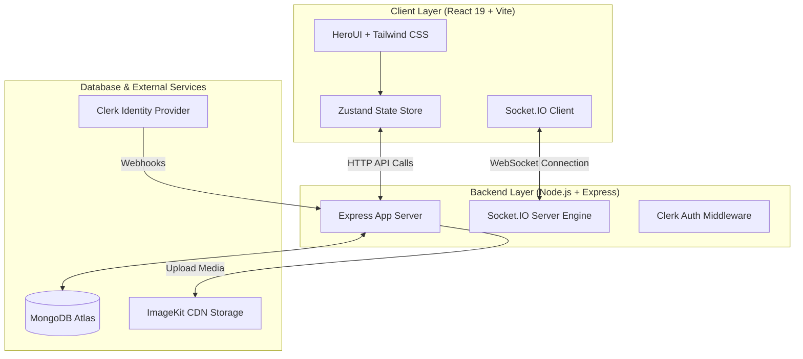

# ⚡ Real-Time MERN Chat Application

An **iMessage-inspired, full-stack real-time messaging application** built with the **MERN Stack (MongoDB, Express.js, React 19, Node.js)**, **Socket.IO**, **Clerk Authentication**, and **ImageKit CDN**. Designed with dynamic theme customization, multi-device presence detection, media uploads, and production-grade reliability.



---

## ✨ Features

- 💬 **Real-Time Bi-Directional Chat**: Instant message delivery using Socket.IO with WebSocket transport and auto-reconnection fallback.
- 🟢 **Live Online Presence (Multi-Device Supported)**: Real-time user status tracking across multiple tabs and devices without false offline triggers on page refresh.
- 🖼️ **Rich Media Sharing**: Support for uploading high-quality images and videos powered by **ImageKit CDN** for auto-compression and optimized delivery.
- 🎨 **iMessage-Inspired UI & Dynamic Themes**:
  - Customizable theme presets (Sky, Spotify, Rose, Emerald, and more)
  - Custom chat background wallpapers
  - Integrated keyboard typing sounds (toggleable)
  - Seamless Light / Dark Mode support
- 🔒 **Enterprise Authentication**: User sign-in, session management, and profile synchronization powered by **Clerk** and webhooks.
- 📱 **Fully Responsive Design**: Optimized mobile-first layout with smooth slide-over navigation for small screens.
- 🛡️ **Production-Ready Infrastructure**: Built-in Multer upload safety limits, CORS validation, Docker containerization, and Render deployment setup.

---

## 🛠️ Tech Stack

### **Frontend**
- **Framework**: React 19 + Vite 8
- **Styling**: Tailwind CSS v4 + HeroUI Components
- **State Management**: Zustand (with state persistence)
- **Icons**: Lucide React
- **Notifications**: React Hot Toast
- **Routing**: React Router v7

### **Backend**
- **Runtime**: Node.js + Express.js v5
- **Database**: MongoDB + Mongoose ORM
- **Real-Time Engine**: Socket.IO v4
- **Auth & Webhooks**: @clerk/express + Svix Webhook Verifier
- **Storage & CDN**: ImageKit Node.js SDK + Multer

---

## 🏗️ System Architecture



---

## 📁 Repository Structure

```
ChatApp/
├── backend/
│   ├── src/
│   │   ├── controllers/      # API Request Handlers (Auth, Messages)
│   │   ├── lib/              # Database, Socket.IO, ImageKit & Cron setups
│   │   ├── middleware/       # Clerk Auth & Multer Upload middlewares
│   │   ├── models/           # Mongoose Schemas (User, Message)
│   │   ├── routes/           # Express API Routes
│   │   ├── webhooks/         # Clerk Webhook Endpoint
│   │   └── index.js          # Backend Server Entry Point
│   ├── Dockerfile            # Container definition
│   └── package.json
│
├── frontend/
│   ├── public/               # Wallpapers, Sounds & Screenshots
│   ├── src/
│   │   ├── components/       # Chat, Auth & UI Components
│   │   ├── context/          # Theme & Wallpaper Context Providers
│   │   ├── hooks/            # Custom Hooks (Keyboard sound, selected chat)
│   │   ├── pages/            # AuthPage & ChatPage
│   │   ├── store/            # Zustand Stores (useAuthStore, useChatStore)
│   │   ├── App.jsx           # Application Router
│   │   └── main.jsx          # React DOM Mount
│   └── package.json
│
└── README.md
```

---

## 🚀 Getting Started

### Prerequisites

- Node.js (v18+ recommended)
- MongoDB Atlas database URI
- Clerk Account (Publishable & Secret keys)
- ImageKit Account (Private & Public keys)

---

### Setup Environment Variables

#### 1. Backend (`backend/.env`)

```env
PORT=3000
MONGO_URI=mongodb+srv://<username>:<password>@cluster.mongodb.net/imessage_db
CLERK_PUBLISHABLE_KEY=pk_test_...
CLERK_SECRET_KEY=sk_test_...
CLERK_WEBHOOK_SIGNING_SECRET=whsec_...
IMAGEKIT_PUBLIC_KEY=public_...
IMAGEKIT_PRIVATE_KEY=private_...
IMAGEKIT_URL_ENDPOINT=https://ik.imagekit.io/<your_account>
FRONTEND_URL=http://localhost:5173
NODE_ENV=development
```

#### 2. Frontend (`frontend/.env`)

```env
VITE_CLERK_PUBLISHABLE_KEY=pk_test_...
VITE_BACKEND_URL=http://localhost:3000
```

---

### Installation & Execution

#### **Running the Backend**

```bash
cd backend
npm install
npm run dev
```

The server will start on `http://localhost:3000`.

#### **Running the Frontend**

```bash
cd frontend
npm install
npm run dev
```

Open your browser at `http://localhost:5173`.

---

## 📡 API Endpoints Summary

| Method | Endpoint | Description | Protected |
| :--- | :--- | :--- | :---: |
| `GET` | `/api/auth/check` | Validates authenticated user profile | Yes |
| `GET` | `/api/messages/users` | Fetches all available users for sidebar | Yes |
| `GET` | `/api/messages/conversations` | Fetches active chat list ordered by recent message | Yes |
| `GET` | `/api/messages/:id` | Fetches message history with target user | Yes |
| `POST` | `/api/messages/send/:id` | Sends text or media message (Multipart file) | Yes |
| `POST` | `/api/webhooks/clerk` | Clerk webhook sync for User Created/Updated/Deleted | Public |

---

## 🐋 Production Deployment (Docker / Render)

### **Docker Setup**

Build and run the single production container:

```bash
docker build -t chatapp .
docker run -p 3000:3000 --env-file ./backend/.env chatapp
```

---

## 🤝 Contributing

Contributions, issues, and feature requests are welcome! Feel free to check the [issues page](https://github.com/).

---

## 📝 License

This project is open source and available under the [ISC License](LICENSE).
